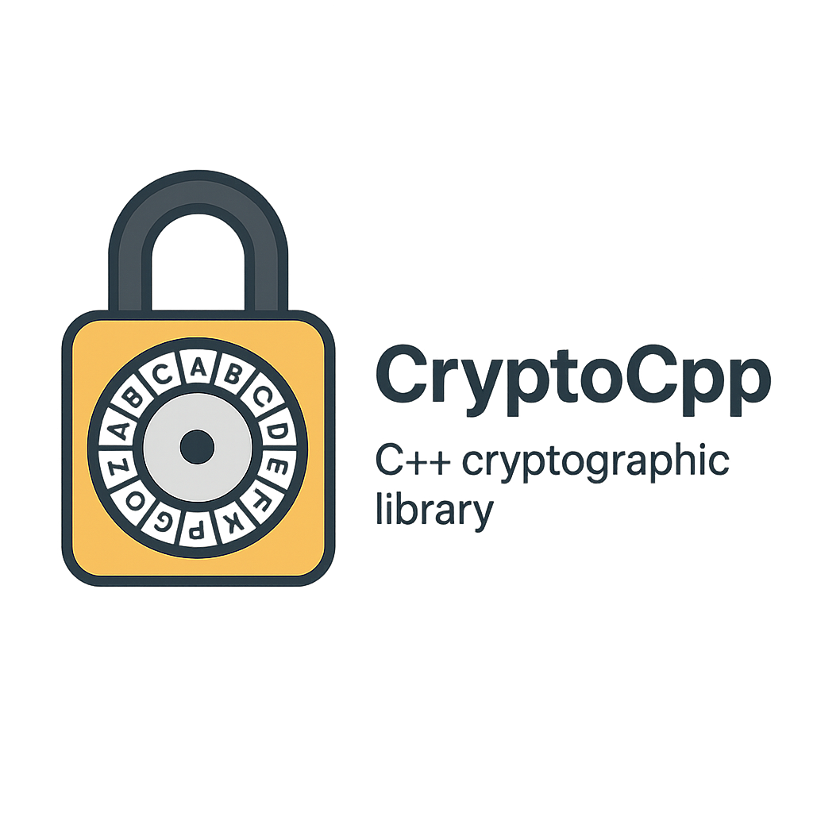

<p align="center">
  
</p>

# CryptoCpp (C++ Cryptography Implementations)

<p align="center">
  <a href="#"></a>
  <a href="#"></a>
  <a href="#"></a>
  <a href="#"></a>
  <a href="#"></a>
</p>

---

Welcome to the **C++ Cryptography Implementation Repository** — **CryptoCpp**  
A personal cryptography learning module where I implement various cryptographic algorithms **from scratch** using C++ (C++17 or newer), without relying on external crypto libraries.

---

## 🚀 Table of Contents
- [Overview](#overview)
- [Project Structure](#project-structure)
- [Build & Run](#build--run)
  - [Prerequisites](#prerequisites)
  - [Compilation](#compilation)
  - [Running Tests](#running-tests)
  - [Running Benchmarks](#running-benchmarks)
- [Cipher Implementation Progress](#cipher-implementation-progress)
- [License (MIT)](#license-mit)

---

## 📄 Overview

- **Purpose**: Deep dive into cryptographic primitives and protocols.
- **Scope**:
  - Classical Ciphers
  - Modern Symmetric & Asymmetric Crypto
  - Hash Functions & MACs
  - ECC & Post-Quantum Crypto
  - Homomorphic Encryption
  - MPC, ZKP, and more...
- **Dependencies**:
  - GoogleTest (`external/gtest`) → Unit Tests
  - Google Benchmark (`external/benchmark`) → Performance Benchmarks

---

## 📂 Project Structure

```
cpp-module/
├── external/                # Git submodules (gtest, benchmark)
├── include/                 # Header files (.hpp)
│   └── classical_ciphers/
│       └── caeser_cipher/
│           └── caeser_cipher.hpp
├── src/                     # Source files (.cpp)
│   └── classical_ciphers/
│       └── caesar_cipher.cpp
├── tests/                   # Unit tests
│   └── caeser_cipher_test.cpp
├── benchmark/               # Benchmarking
│   └── caeser_cipher_bench.cpp
├── Images/                  # Project logo and visuals
│   └── logo.png
├── CMakeLists.txt           # Build script
├── README.md
└── Doxyfile                 # Documentation config
```

---

## ⚙️ Build & Run

### Prerequisites
- C++17 compatible compiler
- CMake ≥ 3.14
- Git

### Compilation
```bash
git submodule init
git submodule update
mkdir build && cd build
cmake .. -DBUILD_TESTING=ON -DBUILD_BENCHMARKS=ON
make -j$(nproc)
```

### Running Tests
```bash
make test
# OR
ctest
# OR run specific test
./test_caeser_cipher
```

### Running Benchmarks
```bash
./caeser_cipher_bench
```

---

## 🛡️ Cipher Implementation Progress

### 1. Classical Ciphers
- [x] **Caesar Cipher**
- [ ] Vigenère Cipher
- [ ] Playfair Cipher
- [ ] Hill Cipher
- [ ] One-Time Pad (Vernam)

### 2. Modern Symmetric Ciphers
- [ ] DES / 3DES  
- [ ] AES  
- [ ] ChaCha20

### 3. Hash Functions & MACs
- [ ] MD5  
- [ ] SHA-1  
- [ ] SHA-2 (256, 512)  
- [ ] HMAC

### 4. Asymmetric Crypto
- [ ] RSA  
- [ ] Diffie-Hellman  
- [ ] ElGamal  
- [ ] DSA

### 5. Elliptic Curve Crypto (ECC)
- [ ] ECC Group Ops  
- [ ] ECDH  
- [ ] ECDSA

### 6. Advanced Protocols
- [ ] KDFs  
- [ ] Hybrid Encryption  
- [ ] TLS-like Protocol

### 7. MPC & Secret Sharing
- [ ] Shamir’s Secret Sharing  
- [ ] Basic 2PC  
- [ ] Garbled Circuits

### 8. Zero-Knowledge Proofs
- [ ] Sigma Protocol  
- [ ] Schnorr Protocol  
- [ ] zk-SNARKs / Bulletproofs

### 9. Homomorphic Encryption
- [ ] Paillier  
- [ ] BGV / BFV

### 10. Post-Quantum Crypto
- [ ] NTRU  
- [ ] Kyber / NewHope  
- [ ] Hash-Based Signatures

### 11. Functional Encryption
- [ ] KP-ABE  
- [ ] CP-ABE  
- [ ] Functional Encryption (Inner Product)

---

## 📄 License (MIT)

```
MIT License

© 2025 Debrup Chatterjee

Permission is hereby granted, free of charge, to any person obtaining a copy
of this software and associated documentation files (the "Software"), to deal
in the Software without restriction, including without limitation the rights
to use, copy, modify, merge, publish, distribute, sublicense, and/or sell
copies of the Software, and to permit persons to whom the Software is
furnished to do so, subject to the following conditions:

The above copyright notice and this permission notice shall be included
in all copies or substantial portions of the Software.

THE SOFTWARE IS PROVIDED "AS IS", WITHOUT WARRANTY OF ANY KIND.
```

---